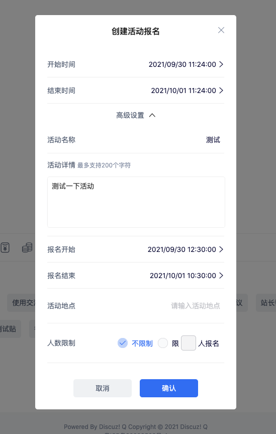
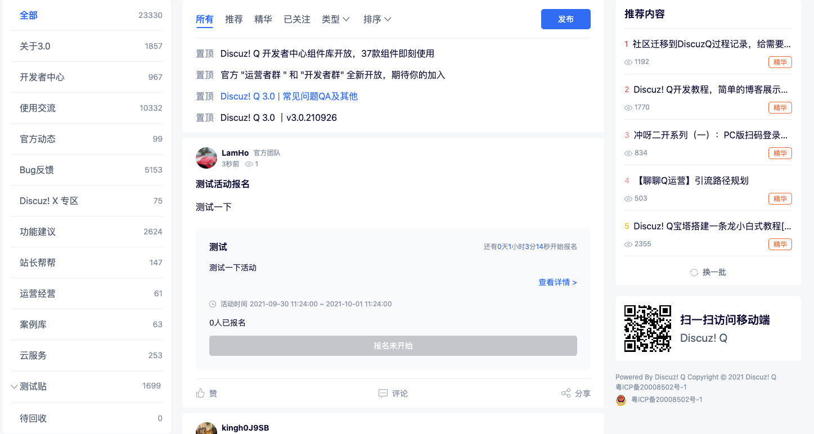
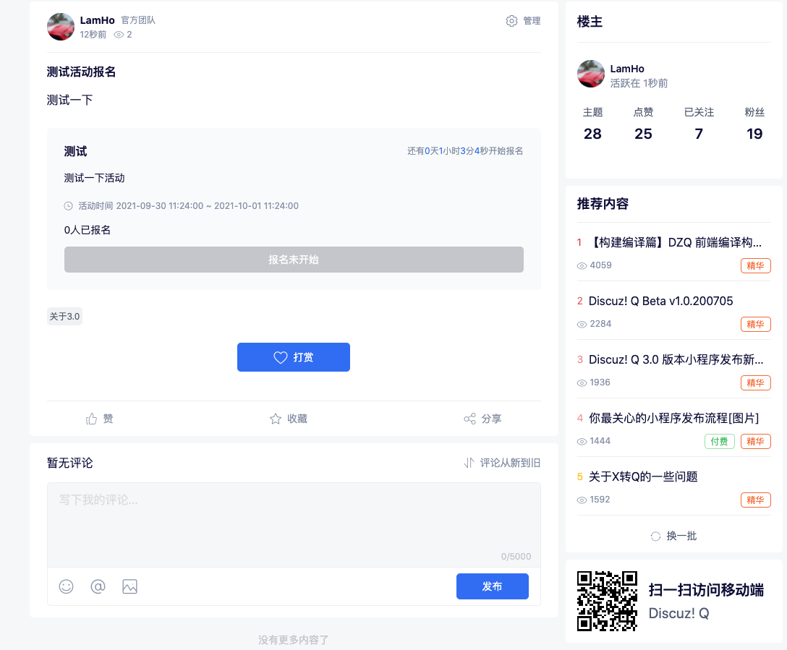

# 开始做一个插件

本实例以报名帖作为案例，一步一步说明如何开发一个后端插件，本案例中涉及到了`新增接口`，`新增表`。具体代码可以拉取Gitee仓库进行查看。







#### 步骤1：添加插件目录和配置文件

进入项目根目录找到`plugin`目录，新建一个文件目录，名称为你的插件应用的英文名称，`首字母大写`，该目录即是一个插件的所有业务代码逻辑的边界，以报名帖为例，新建了一个`Activity`目录。 同时新建以下6个目录

> `Console` 命令行逻辑
>
> `Controller` 接口控制器
>
> `Database` 插件数据表
>
> `Model` 数据模型
>
> `Routes` 接口路由
>
> `View` 插件前端逻辑,包含各个模块的js,css，资源文件等

在插件根目录新建`config.json`文件 报名贴插件配置文件路径 `plugin/Activity/config.json`

```json
{
    // 通用
    "name_cn":"活动报名",
    "name_en":"activity",
    "description":"帖子类型里添加报名插件",
    "type":1,
    "app_id":"612f4217ae890",
    "version":"v1.0.1",
    "status":1,
    "author":{
        "name":"腾讯科技（深圳）有限公司",
        "email":"coralchu@tencent.com"
    },
    // 私有
    "filter_enable":false,
    "busi":"Plugin\\Activity\\ActivityBusi",
    "view": {
        // ....
    }
}
```

#### 步骤2：设计插件表结构

如果您的插件需要新增数据表，那么需要遵循以下的表设计规范。

基础框架提供了插件使用的基础类，在插件开发过程中尽可能使用以下基础类作为基类

`DzqAdminController` 管理端接口基类

`DzqController` 用户端接口基类

`DzqCommand` 命令行基类

`DzqKernel` 定时脚本基类

`DzqModel` orm模型基类

`DzqPluginMigration` 数据迁移基类

以活动报名为例，一个正常的报名流程，包含发起人的`发布活动` `编辑活动` `查看报名列表`以及参与人的 `参加报名` `取消报名`

基于该背景需要新建两张数据表

- `thread_activity` 活动明细表

- `activity_user` 用户报名表

  在创建您的新表的时候，需要在 `plugin/Activity/Database/migrations` 目录下新建两个表的`migrate`文件，可以使用框架的`make:migration`命令生成, 例如 `php disco make:migration plugin_activity_thread_activity --create`,执行以后会在项目根目录下的`database/migrations`下生成一个空的数据库创建文件， 开发者可以将其移动到插件目录`Database/migrations`下。

  同时该命令也可以指定路径生成文件， `php disco make:migration plugin_activity_thread_activityccc --create --path=plugin/Activity/Database/migrations` 这样就可以将文件直接生成在插件对应的位置了 这里生成的是:

- `2021_09_10_112512_create_plugin_activity_thread_activity.php`

- `2021_09_10_130011_create_plugin_activity_user.php`

  > 在编辑具体的表结构前，请将继承的基类由默认的`Migration`改成`DzqPluginMigration`

**建表的时候务必遵循以下规范：**

- 数据迁移类务必继承`DzqPluginMigration`，且表的前缀添加`plugin`+`插件英文名称`，报名帖前缀为`plugin_activity_`，招聘贴前缀为 `plugin_jobs_`
- 插件应用的所有DDL操作，禁止涉及官方的表结构，只允许操作插件本身创建的表
- 数据表以小写+下划线的方式命名
- 推荐每张表添加`created_at`和`updated_at`字段

结合以上规范，报名贴新建的表为：`plugin_activity_thread_activity` `plugin_activity_user`，在插件目录`Model`新建模型 通过migration目录添加的插件数据表需要在控制台执行命令以创建数据表

##### 活动明细表

```php
<?php
use Discuz\Base\DzqPluginMigration;
use Illuminate\Database\Query\Expression;
use Illuminate\Database\Schema\Blueprint;
class CreatePluginActivityThreadActivity extends DzqPluginMigration
{
    /**
     * Run the migrations.
     *
     * @return void
     */
    public function up()
    {
        $this->schema()->create('plugin_activity_thread_activity', function (Blueprint $table) {
            $table->unsignedBigInteger('id', true)->comment('自增id');
            $table->unsignedBigInteger('user_id')->comment('用户id');
            $table->unsignedBigInteger('thread_id')->comment('帖子id');
            $table->string('title', 100)->nullable(false)->comment('活动名称');
            $table->text('content')->comment('活动内容');
            $table->dateTime('activity_start_time')->comment('活动开始时间');
            $table->dateTime('activity_end_time')->comment('活动结束时间');
            $table->dateTime('register_start_time')->nullable(true)->comment('报名开始时间');
            $table->dateTime('register_end_time')->nullable(true)->comment('报名结束时间');
            $table->integer('total_number')->default(0)->comment('报名人数上限 0:不限制');
            $table->string('address', 200)->nullable(false)->default('')->comment('地址信息');
            $table->string('location', 200)->nullable(true)->default('')->comment('位置信息');
            $table->decimal('longitude', 10, 7)->default(0.0000000)->nullable(false)->comment('经度');
            $table->decimal('latitude', 10, 7)->default(0.0000000)->nullable(false)->comment('纬度');
            $table->tinyInteger('status')->default(1)->comment('0:无效 1：有效');
            $table->timestamp('created_at')->nullable(false)->default(new Expression('CURRENT_TIMESTAMP'))->comment('创建时间');
            $table->timestamp('updated_at')->nullable(false)->default(new Expression('CURRENT_TIMESTAMP ON UPDATE CURRENT_TIMESTAMP'))->comment('更新时间');
        });
    }

    /**
     * Reverse the migrations.
     *
     * @return void
     */
    public function down()
    {
        $this->schema()->dropIfExists('plugin_activity_thread_activity');
    }
}
```

##### 报名表

```php
<?php

use Discuz\Base\DzqPluginMigration;
use Illuminate\Database\Query\Expression;
use Illuminate\Database\Schema\Blueprint;

class CreatePluginActivityUser extends DzqPluginMigration
{
    /**
     * Run the migrations.
     *
     * @return void
     */
    public function up()
    {
        $this->schema()->create('plugin_activity_user', function (Blueprint $table) {
            $table->unsignedBigInteger('id', true)->comment('自增id');
            $table->unsignedBigInteger('thread_id')->nullable(false)->comment('主题id');
            $table->unsignedBigInteger('activity_id')->nullable(false)->comment('活动id');
            $table->unsignedBigInteger('user_id')->nullable(false)->comment('用户id');
            $table->tinyInteger('status')->default(1)->comment('0:无效 1：有效');
            $table->timestamp('created_at')->nullable(false)->default(new Expression('CURRENT_TIMESTAMP'))->comment('创建时间');
            $table->timestamp('updated_at')->nullable(false)->default(new Expression('CURRENT_TIMESTAMP ON UPDATE CURRENT_TIMESTAMP'))->comment('更新时间');
            $table->index('thread_id');
            $table->index(['activity_id','user_id']);
        });
    }

    /**
     * Reverse the migrations.
     *
     * @return void
     */
    public function down()
    {
        $this->schema()->dropIfExists('plugin_activity_users');
    }
}
```

#### 步骤3：创建插件数据表

`php disco migrate:plugin --name=activity` *该功能需要站长执行（管理后台的插件管理面板正在开发中，开发完成以后，站长在安装插件的时候会自动执行数据迁移命令）*

```apache
# php disco migrate:plugin --name=activity
Migrating: 2021_09_10_112512_create_plugin_activity_thread_activity
Migrated:  2021_09_10_112512_create_plugin_activity_thread_activity (0.01 seconds)
Migrating: 2021_09_10_130011_create_plugin_activity_user
Migrated:  2021_09_10_130011_create_plugin_activity_user (0.01 seconds)
```

数据库新建表成功后便可以在插件目录 `Model` 里添加数据模型，报名帖新增`ActivityUser.php` 和`ThreadActivity.php`两个ORM模型文件

##### ActivityUser.php

```php
<?php

namespace Plugin\Activity\Model;


use Discuz\Base\DzqModel;

class ActivityUser extends DzqModel
{
    protected $table = 'plugin_activity_user';

}
```

##### ThreadActivity.php

```php
<?php

namespace Plugin\Activity\Model;


use Discuz\Base\DzqModel;

class ThreadActivity extends DzqModel
{
    protected $table='plugin_activity_thread_activity';

}
```

#### 步骤4：开发插件业务逻辑

帖子类型插件需要新增`ActivityBusi.php`文件来实现发帖区的内容`增删查改`，那么需要在插件配置文件`config.json`里新增一条配置`"busi":"Plugin\\Activity\\ActivityBusi"` 该文件需要继承帖子类型的特有基础类`TomBaseBusi` 并实现其 `select` `create` `delete` `update` 四个方法，可以参考`ActivityBusi.php`，该busi文件实现了帖子中内容发布、变更。 除此以外的操作需要开发者另新增接口实现。

新增接口控制器需要继承`DzqController`,例如获取报名用户列表

```php
<?php
namespace Plugin\Activity\Controller;

use App\Common\DzqConst;
use App\Models\User;
use App\Repositories\UserRepository;
use Discuz\Base\DzqController;
use Plugin\Activity\Model\ActivityUser;
class ListController extends DzqController
{
    use ActivityTrait;
    protected function checkRequestPermissions(UserRepository $userRepo)
    {
        return $this->checkPermission($userRepo,true);
    }
    public function main()
    {
        $activityId = $this->inPut('activityId');
        $perPage = $this->inPut('perPage');
        $page = $this->inPut('page');

        $aUsers = ActivityUser::query()
            ->where([
                'activity_id' => $activityId,
                'status' => DzqConst::BOOL_YES
            ])->select('user_id as userId')->orderByDesc('updated_at');
        $data = $this->pagination($page, $perPage, $aUsers);
        $userIds = array_column($data['pageData'], 'userId');
        $users = User::query()->whereIn('id', $userIds)->get()->keyBy('id');
        foreach ($data['pageData'] as &$item) {
            $userId = $item['userId'];
            $item['avatar'] = '';
            $item['nickname'] = '';
            if (isset($users[$userId])) {
                $item['avatar'] = $users[$userId]['avatar'];
                $item['nickname'] = $users[$userId]['nickname'];
            }
        }
        $this->outPut(0, '', $data);
    }
}
```

#### 步骤5：插件接口路由配置

报名贴需要新增 `register/append 提交报名信息` `register/cancel 取消报名` `register/list 报名用户列表` 三个接口 进入`Routes`目录添加路由配置文件，该目录下可以任意定义`php文件`名称，也可以任意拆分成多个`php文件`，框架会自动扫描Routes目录下的所有可用路由配置。 本示例在Routes目录下新建`Api.php`并配置如下路由表

```php
<?php
/**@var Discuz\Http\RouteCollection $route*/

//提交报名信息
$route->post('register/append', 'register.append', \Plugin\Activity\Controller\AppendController::class);
//取消报名
$route->post('register/cancel', 'register.cancel', \Plugin\Activity\Controller\CancelController::class);
//报名用户列表
$route->get('register/list', 'register.list', \Plugin\Activity\Controller\ListController::class);
```

接口调用规则：

> 配置自定义接口路由的时候，请注意，接口的访问`Method`只能选用get或post,其他http类型如`delete patch option`等不支持
>
> 前端在调用自定义插件接口的时候，需要以`plugin/{插件英文名称}/api/`为前缀以避免和其他插件的接口造成冲突

例如:

- 查看列表接口url：`https://web.archive.org/web/20230520034731/https://discuz.chat/plugin/activity/api/register/list`
- 参与报名接口url：`https://web.archive.org/web/20230520034731/https://discuz.chat/plugin/activity/api/register/append`
- 取消报名接口url：`https://web.archive.org/web/20230520034731/https://discuz.chat/plugin/activity/api/register/cancel`

##### 接口替换

插件路由表方法`$route->get`和`$route->post`提供了自定义接口覆盖替换官方接口的功能，开发者只需要在该方法的第四个参数`replaceHandler`里填写想要覆盖的接口控制器名称即可。 例如开发者在报名帖里新增`register/thread.list`接口，该接口复用了`/api/v3/thread.list`接口的逻辑并做了一些修改，如下设置即可实现替换

```php
$route->get('register/thread.list', 'register.thread.list',
    \Plugin\Activity\Controller\ThreadListController::class,
    \App\Api\Controller\Threads\ThreadListController::class
);
```

用户在请求`/api/v3/thread.list`接口的时候，框架会自动路由到报名贴插件的接口`register/thread.list`

##### 接口限频

路由对象`$route`提供了`function withFrequency($callback,$times,$interval,$delay)`方法，框架中间件从`用户ip和用户id`两个维度记录了请求次数，`withFrequency`方法能够对某个路由或某一组路由配置限频策略，合理的限频策略对网站能起到一定的安全防护作用，如果不配置，框架中间件里会提供兜底的防护策略 `GET`类型接口每30秒限制20次请求，超过则禁止5分钟 `POST`类型接口每60秒限制30次，超过则禁止5分钟

#### 步骤6：计划任务

大部分插件应用在步骤5已经完成了所有后台业务开发，然有些应用可能需要计划任务或者控制台命令以完成初始化或者定期批处理的操作。 请在插件目录`Console`里定制你的脚本，参看活动报名插件内置的范例，

新建一个 `TestCommand.php` 继承 `DzqCommand` 添加一个自定义命令

```php
<?php

namespace Plugin\Activity\Console;


use Discuz\Base\DzqCommand;

class TestCommand extends DzqCommand
{

    protected $signature = 'activity:test';
    protected $description = '执行一个脚本命令,控制台执行[php disco activity:test]';
    protected function main()
    {
        $this->info('Hello Discuz! Q Plugin Activity');
    }
}
$signature` 定义的命令名称必须以插件英文名称作为前缀 `{插件英文名称}:{命令名称}`，活动报名插件添加了一个 `test` 自定义命令，那么`$signature` 就赋值为 `activity:test` 如果要手动执行该命令，请在控制台输入`php disco activity:test
```

输出如下：

```markdown
Plugin\Activity\Console\TestCommand RUNNING ...

************************** START 2021-10-14 10:56:43 START ****************************

Hello Discuz! Q Plugin Activity


**************************  END   2021-10-14 10:56:43 END  ****************************
```

同目录新建 `Kernel.php` 继承 `DzqKernel` 添加一个任务计划

```php
<?php

namespace Plugin\Activity\Console;

use Discuz\Base\DzqKernel;
use Illuminate\Console\Scheduling\Schedule;

class Kernel extends DzqKernel
{
    public function schedule(Schedule $schedule)
    {
        $schedule->command('activity:test')->everyFiveMinutes()->appendOutputTo('/data/logs/schedule.log');
    }
}
```

### 前端插件支持

插件标准目录提供了`View`目录，前端脚手架编译出的插件需要的`js和css`文件均会存放在`View/dist`下的某个自定义模块分类下 例如：

```css
View/
├── dist
│   ├── CustomIfram
│   │   ├── index.css
│   │   └── index.js
│   ├── CustomIframDisplay
│   │   └── index.js
│   └── CustomIframPost
│       └── index.js
└── src
    ├── CustomIfram
    │   ├── adapter
    │   │   ├── index.js
    │   │   ├── mini
    │   │   │   └── index.jsx
    │   │   └── web
    │   │       ├── index.jsx
    │   │       └── index.scss
    │   ├── images
    │   │   ├── WechatIMG129.jpeg
    │   │   └── WechatIMG130.jpeg
    │   └── main.js
    ├── CustomIframDisplay
    │   ├── adapter
    │   │   ├── index.js
    │   │   ├── mini
    │   │   │   └── index.jsx
    │   │   └── web
    │   │       └── index.jsx
    │   └── main.js
    └── CustomIframPost
        ├── adapter
        │   ├── index.js
        │   ├── mini
        │   │   └── index.jsx
        │   └── web
        │       └── index.jsx
        └── main.js
```

插件的配置文件`config.json`需要添加View的相关配置，示例如下：

```json
{
    "name_cn":"iframe插件",
    "name_en":"CustomIfram",
    "description":"帖子类型里添加iframe插件",
    "type":9,
    "app_id":"6177c3415793a",
    "version": "1.0.0",
    "status":1,
    "icon":"https:\/\/web.archive.org\/web\/20230520034731\/https:\/\/discuz.chat\/dzq-img\/active.png",
    "filter_enable":false,
    "author":{
        "name":"腾讯科技（深圳）有限公司",
        "email":"coralchu@tencent.com"
    },
    "view": {
        "CustomIfram": {
            "target": "plugin_post",
            "hookName": "post_extension_entry_hook",
            "platform": ["pc", "h5", "mini"],
            "disables": false
        },
        "CustomIframDisplay": {
            "target": ["plugin_index", "plugin_detail"],
            "hookName": "thread_extension_display_hook",
            "platform": ["pc", "h5", "mini"],
            "disables": false
        },
        "CustomIframPost": {
            "target": "plugin_post",
            "hookName": "post_extension_content_hook",
            "platform": ["pc", "h5", "mini"],
            "disables": false
        }
    }
}
```

插件列表接口`/api/v3/plugin/list`会返回所有插件的静态文件URL， 客户端会依据hook配置项加载对应的文件，从而触发插件的页面展示（插件的静态文件通过`动态路由/plugin/{plugin_name}/{module_name}/{file_path}`返回给客户端）。

```json
{
    "name_cn":"iframe插件",
    "name_en":"CustomIfram",
    "description":"帖子类型里添加iframe插件",
    "type":9,
    "app_id":"6177c3415793a",
    "version":"1.0.0",
    "status":1,
    "icon":"https://web.archive.org/web/20230520034731/https://discuz.chat/dzq-img/active.png ",
    "filter_enable":false,
    "author":{
        "name":"腾讯科技（深圳）有限公司",
        "email":"coralchu@tencent.com"
    },
    "view":{
        "CustomIfram":{
            "target":"plugin_post",
            "hookName":"post_extension_entry_hook",
            "platform":[
                "pc",
                "h5",
                "mini"
            ],
            "disables":false,
            "pluginFiles":{
                "css":[
                    "https://web.archive.org/web/20230520034731/http://v3.go/plugin/CustomIfram2/CustomIfram/index.css "
                ],
                "js":[
                    "https://web.archive.org/web/20230520034731/http://v3.go/plugin/CustomIfram2/CustomIfram/index.js "
                ]
            }
        },
        "CustomIframDisplay":{
            "target":[
                "plugin_index",
                "plugin_detail"
            ],
            "hookName":"thread_extension_display_hook",
            "platform":[
                "pc",
                "h5",
                "mini"
            ],
            "disables":false,
            "pluginFiles":{
                "js":[
                    "https://web.archive.org/web/20230520034731/http://v3.go/plugin/CustomIfram2/CustomIframDisplay/index.js "
                ]
            }
        },
        "CustomIframPost":{
            "target":"plugin_post",
            "hookName":"post_extension_content_hook",
            "platform":[
                "pc",
                "h5",
                "mini"
            ],
            "disables":false,
            "pluginFiles":{
                "js":[
                    "https://web.archive.org/web/20230520034731/http://v3.go/plugin/CustomIfram2/CustomIframPost/index.js "
                ]
            }
        }
    },
    "authority":{
        "title":"插入iframe插件",
        "permission":"canInsert",
        "canUsePlugin":false
    },
    "setting":[

    ]
}
```

#### 注意事项

推荐`v3.0.211111`或更新版本开发插件