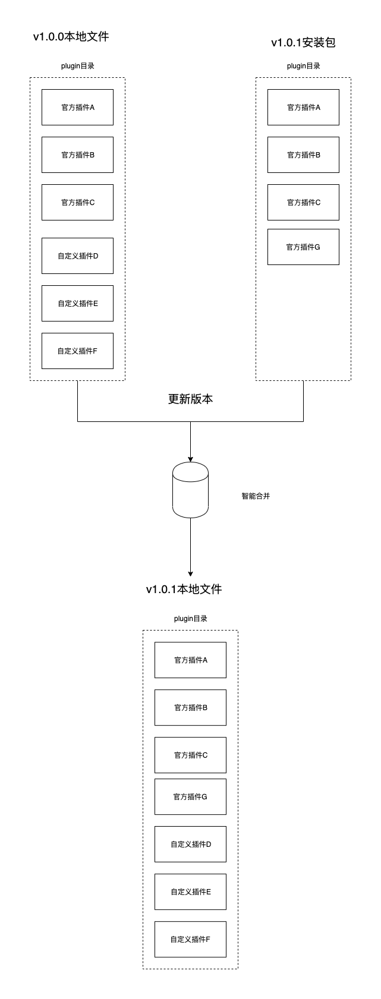

# 插件接口开发

### 后端插件开发

插件分成很多种类，如，发帖类型插件、广告插件、表情插件等，官方会持续增加更多的类型，每个插件类型都会在框架里预留对应的能力，其配置文件`config.json`也可能会有少许差异，具体到各种插件的开发差异需要参看后续推出的**DZQ插件示例文档**，同时，开发者也可以通过自定义接口的方式开发非特定类型的插件， 本指南指在阐述后端插件开发的基本流程。 以报名帖为例，开发者需要给自己的插件起一个唯一的英文名称 `name_en`且设置一个唯一的应用id `app_id` （官方开放插件市场以后，英文名称和app_id需要通过注册获取）。

### 环境搭建

在开始开发您的Discuz! Q应用之前，需要安装一个可正常访问的站点，阅读 **[安装文档](https://web.archive.org/web/20230520034614mp_/https://discuz.com/docs/Linux 主机.html#nginx)** 依据步骤安装好站点环境。

### 项目结构

以下是每个Discuz !Q 3.0的服务器文件目录说明

```sql
├── app ----------- 主业务逻辑
├── config -------- 项目配置文件
├── database ------ 数据表迁移 
├── framework ----- 框架文件
├── plugin -------- 插件目录
├── public -------- 业务入口以及H5和Admin的客户端项目
├── resources ----- 其他资源类
├── routes -------- 路由
├── storage ------- 本地文件及缓存文件
├── vendor -------- 依赖目录
├── disco --------- 控制台命令入口
```

> plugin目录为插件存放目录，开发者或使用者可以通过存放`标准的`的插件文件到plugin目录下，插件会自动生效。

注意：

- plugin目录下的插件文件名不能重复
- 前端插件热插拔正在开发中

### 智能合并

当前`plugin`目录下存放着官方插件和自定义的插件，在每次更新版本时，更新脚本将会智能的合并覆盖`plugin`目录，如当前`plugin`目录下有`A`、`B`、`C`三个官方插件，开发中上传了`E`、`F`两个插件，这时`plugin`目录下会有`A`、`B`、`C`,`E`、`F`五个插件，这时进行版本升级，新安装包只会覆盖`A`、`B`、`C`三个官方插件，自己上传的插件不会被覆盖。



### 插件唯一标识

以报名帖为例，开发者需要给自己的插件起一个唯一的英文名称 `name_en`且设置一个唯一的应用id `app_id` （官方开放插件市场以后，英文名称和app_id需要通过注册获取）。

### 注意事项

- v3.0210926插件配置文件是config.php且不支持本指南中的路由配置方式，
- 在v3.0211014之后支持本指南的接口路由配置方式，且配置文件变更为JSON格式。