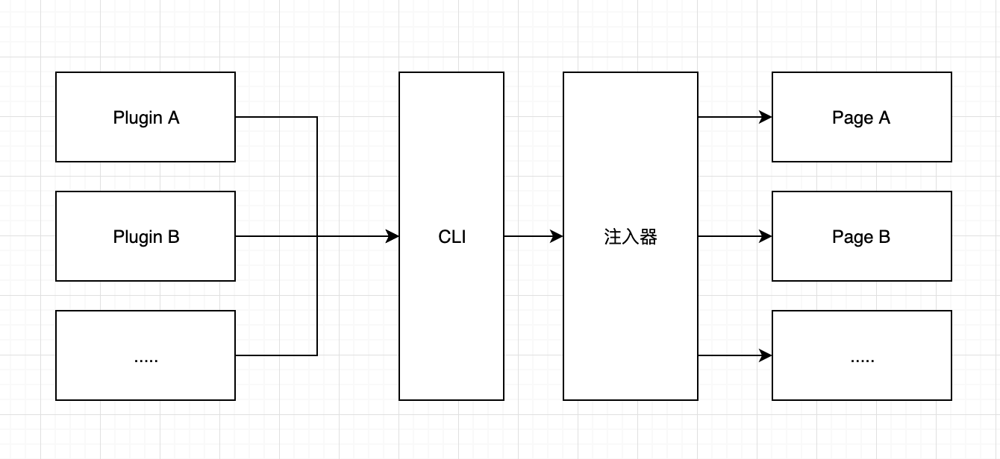
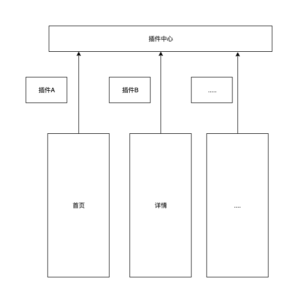

# 插件架构

在Discuz !Q进行编译时，脚手架会对一个固定的文件位置进行读取，会自动识别标准的插件文件，并且会根据插件描述文件中指定的`target`和`hookName`的字段，通过`@discuzq/cli`中内置的插件注入器，对插件代码进行注入到相应的页面中。

> 插件的`platform`会在编译时，根据编译的模式，忽略非当前编译环境的插件，不会注入到代码中。

## 插件注册

Discuz !Q内置一个插件中心，负责将整个Discuz !Q使用的插件都会注册进插件中心中，提供整个Discuz !Q使用。插件中心对于插件注册有以下限制：

- 同一个`target`和`hookName`中，每个插件的名称是`唯一`的。
- 如果在同一个`target`和`hookName`中，出现同名插件，那么将会对比版本号，取最新的版本号插件进行存储。

> Discuz !Q插件中心，将以`target`和`hookName`拼接作为作用域。

## 插件渲染

已经具备插件钩子的页面，在每次渲染的时候，都会向插件中心获取属于当前`taget`对应`hookName`的插件，并且进行渲染。

渲染时，由Discuz !Q团队对于每个`hook`传入固定的参数供插件使用。