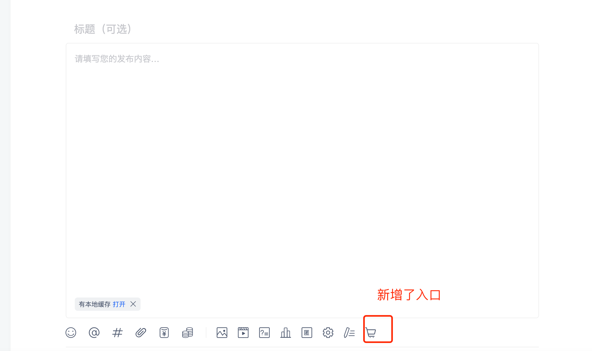
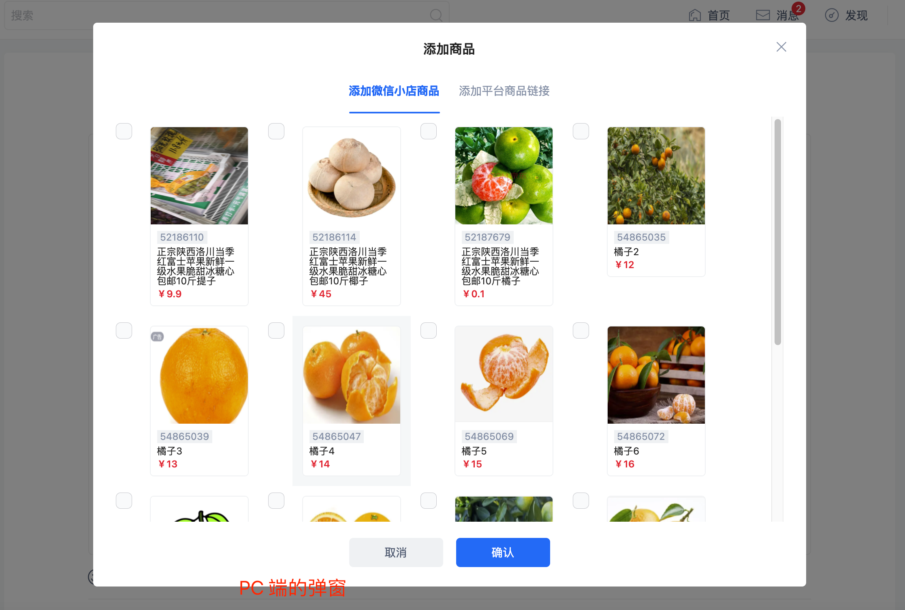
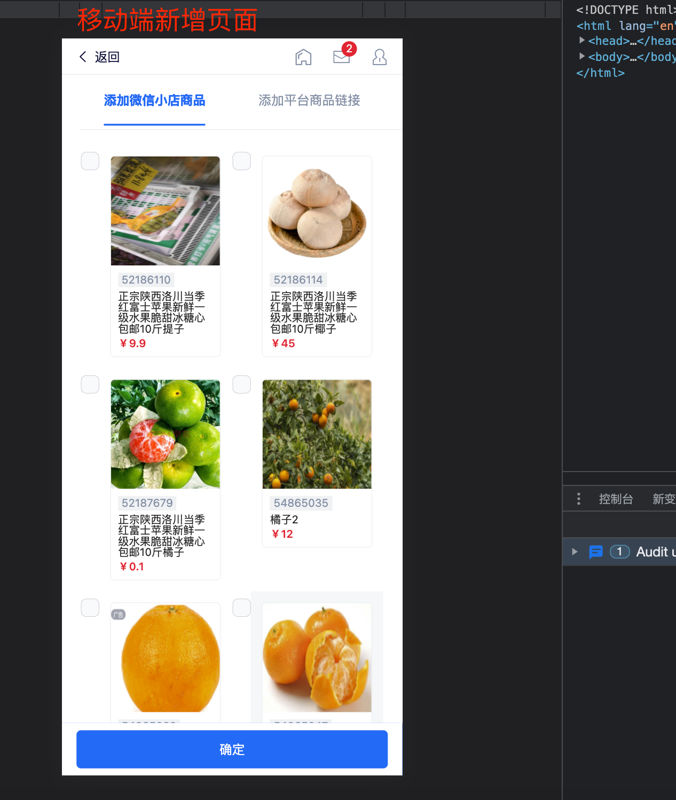
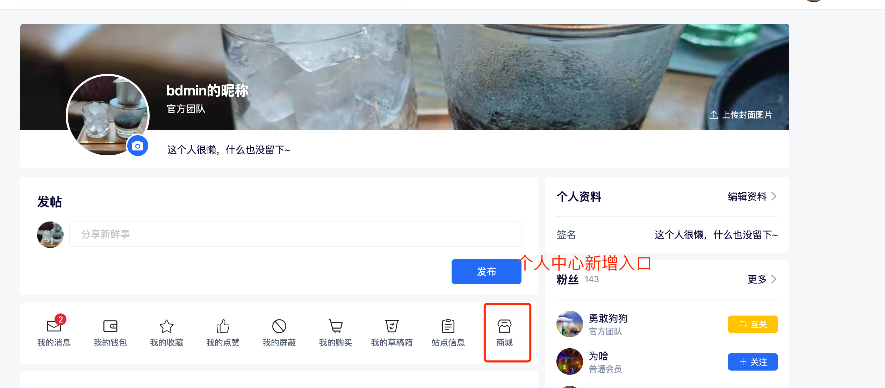
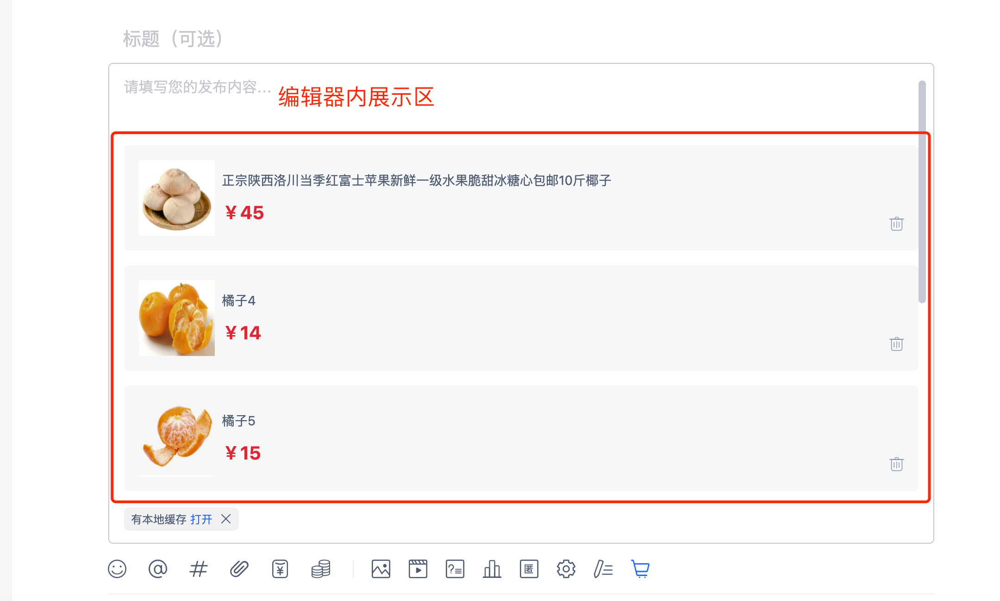
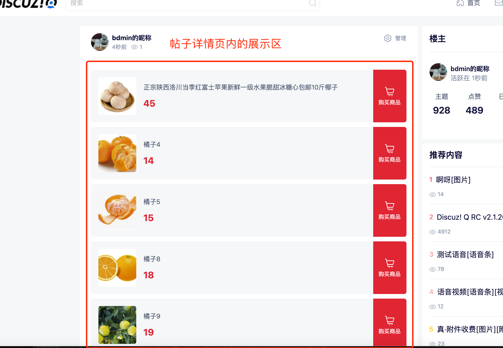
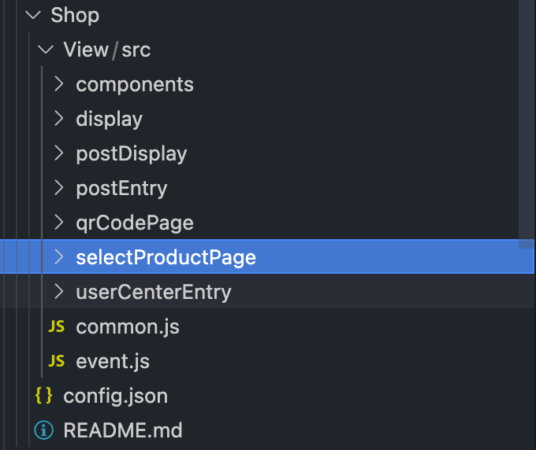

# 页面插件开发指引

我们以 商店插件 开发流程为例，来讲述如何开发一个同时具有多个页面、注入了多个插槽的插件

由于篇幅限制，我们仅在此篇文档中讲述其中的关键问题

## 分析业务

如下图，商店业务涉及到了囊括 发帖区域注册按钮、发帖内容区展示、商品选择页面、帖子详情内容区展示、个人中心功能区注册、二维码页面注册














## 使用插槽

根据左侧页面标识列表，我们分析

为了完成发帖部分的入口、发帖区展示

我们需要用到 plugin_post 中的 post_extension_entry_hook 和 post_extension_content_hook 这两个注入 hook

> 参见 [发帖页Hooks列表](../hooks/plugin_post_hooks.md)

为了完成新增页面的能力，我们需要用到 plugin_system 中的 add_page_hook，来新增选择商品页面和展示小商店二维码页面

> 参见 [全局Hooks列表](../hooks/plugin_system_hooks.md)

为了完成个人中心部分新增 商店 入口的能力，我们需要用到 plugin_user 中的 user_extension_action_hook, 来在个人中心中新增 商店 的入口

> 参见 [个人中心Hooks列表](../hooks/plugin_user_center_hooks.md)

为了在帖子详情页和首页中展示我们插件对应的内容，我们需要用到 plugin_index 和 plugin_detail 中的 thread_extension_display_hook，来在首页、详情页中增加我们的展示

> 首页参见 [首页Hooks列表](../hooks/plugin_index_hooks.md)
>
> 详情页参见 [详情页Hooks列表](../hooks/plugin_detail_hooks.md)

按照标准文档填写后，我们可以得到如下的项目配置

```json
{
  "name_cn": "商品贴插件",
  "name_en": "shop",
  "description": "商品贴插件",
  "type": 9,
  "app_id": "61540fef8f4de8",
  "version": "1.0.0",
  "status": 1,
  "icon": "https://discuz.chat/dzq-img/active.png",
  "filter_enable": false,
  "author": {
    "name": "腾讯科技（深圳）有限公司",
    "email": "bababaababa@tencent.com"
  },
  "view": {
    "display": {
      "target": ["plugin_index", "plugin_detail"],
      "hookName": "thread_extension_display_hook",
      "platform": ["pc", "h5", "mini"],
      "disables": false
    },
    "postDisplay": {
      "version": "1.0.0",
      "target": "plugin_post",
      "hookName": "post_extension_content_hook",
      "platform": ["pc", "h5", "mini"],
      "disables": false
    },
    "postEntry": {
      "target": "plugin_post",
      "hookName": "post_extension_entry_hook",
      "platform": ["pc", "h5", "mini"],
      "disables": false
    },
    "qrCodePage": {
      "target": "plugin_system",
      "hookName": "add_page_hook",
      "platform": ["pc", "h5"],
      "path": "/minishop/qrcode",
      "miniPageConfig": {
        "navigationBarTitleText": "二维码"
      },
      "disables": false
    },
    "selectProductPage": {
      "target": "plugin_system",
      "hookName": "add_page_hook",
      "platform": ["pc", "h5", "mini"],
      "path": "/selectProduct",
      "miniPageConfig": {
        "navigationBarTitleText": "选择商品"
      },
      "disables": false
    },
    "userCenterEntry": {
      "target": "plugin_user",
      "hookName": "user_extension_action_hook",
      "platform": ["pc", "h5", "mini"],
      "disables": false
    }
  }
}
```

## 插件项目结构

根据上述的配置，按照目录规范的要求，我们可以得到下图所示的目录结构

> 目录规范要求参见 [目录规范](../start/dir.md)



如上，其中 `selectProductPage` 目录对应了 `h5` 和 `小程序` 中新增的选择商品

`qrCodePage` 目录对应了 `h5` 的微信小商店二维码页面

```
选择商品页面` 对应的页面路径分别为 web -> `/plugin/selectProduct`，小程序 -> `/pluginPages/selectProduct/index
小商店二维码页面` 对应的页面路径分别为 web -> `/plugin/minishop/qrcode`，小程序 -> `/pluginPages/minishop/qrcode/index
```

## 自定义 API 调用

在 `商店插件` 中，我们在 `后台插件` 中新增了 `获取小商品列表` 和 `获取第三方商品分析` 的接口

根据 [通用参数](../hooks/common_props.md) 文档可知，我们可以通过 `this.props.dzqRequest` 获取到 `http` 客户端实例，并且我们封装了统一的请求错误处理函数 `this.props.dzqRequestHandleError`

以获取微信小商店商品列表为例，我们可以在对应的组件中声明如下

```javascript
fetchMiniShopProductList = async (page) => {
  const { dzqRequest } = this.props;

  // 请求前 loading
  this.setState({
    loading: true,
  });

  try {
    // 请求声明
    const { code, data, msg } = await dzqRequest.request.http({
      url: "/plugin/shop/api/wxshop/list",
      method: "GET",
      params: {
        page,
        perPage: "16",
      },
    });

    if (code !== 0) {
      Toast.error({
        content: msg,
      });
    }

    //业务逻辑
    const { totalCount, totalPage, pageData, currentPage } = data;

    const { miniShopProducts } = this.state;

    const nextMiniShopProducts = Object.assign(
      {},
      {
        [currentPage]: pageData,
        ...miniShopProducts,
      }
    );
    this.setState({
      totalPage,
      totalCount,
      miniShopProducts: nextMiniShopProducts,
    });
    //业务逻辑

    //处理 loading 状态
    this.setState({
      loading: false,
    });

    return nextMiniShopProducts;
  } catch (error) {
    //处理 loading 状态
    this.setState({
      loading: false,
    });

    //错误兜底处理
    this.props.dzqRequestHandleError(error);
  }
};
```

如此，我们便拥有了请求自定义 API 的能力

## 多个 hook 组件间代码复用

在 `商店插件` 中，小商店的 `商品项` 组件是 `小程序商品选择页`、`h5商品选择页`、`pc商品选择弹窗` 中共用的一个组件

这里我们在 `View` 目录下创建 `components` 目录，用来放置共用的组件

这里我们创建 `shopProductItem` 组件，里面创建 `web` 和 `mini` 两个目录

利用 `适配器模式` 实现 `端区分`，实现小程序的逻辑于 `mini` 目录中，实现 `web` 的逻辑于 `web` 中

> 适配器模式 可以参见：[多端适配器](../components/adapter.md)

其代码如下

index.jsx

```javascript
let pluginComponent = () => {};
if (process.env.DISCUZ_ENV === 'mini') {
  pluginComponent = require('./mini/index.jsx');
}
if (process.env.DISCUZ_ENV === 'web') {
  pluginComponent = require('./web/index.jsx');
}

export default pluginComponent.default;
```

那么在各个注入 hook 的实现中，我们可以以如下代码进行引入

这里可以自行区分不同端，完成代码复用

```javascript
import ShopProductItem from '../../../components/shopProductItem'; // 后面为对应目录层级
```

## 获取插件对应的后台配置

我们的插件有对应的后台管理系统部分，在那里进行了插件相关属性的配置声明

每个插件具有自己独一无二的 appid

我们将所有的插件配置信息进行了统一的获取与存储，都存储于 `this.props.siteData.pluginConfig` 中，仅需通过查找其中 app_id 相等的一项，即可获取到自己对应的插件配置

```javascript
const { siteData = {} } = this.props || {};
const pluginConfig = siteData.pluginConfig || [];

const shopPluginConfig = pluginConfig.find((currentPluginConfig) => {
  if (currentPluginConfig.app_id === '61540fef8f4de8') {
    return currentPluginConfig;
}
```

## 路由跳转能力

`DZQ` 的项目 `web` 和 `小程序` 使用了不同的框架，故其对应的路由方法也不同

在 `DZQ sdk` 中，我们提供了统一的抽象

> 参见: [Router 路由](../other/src_router.md)

`商店插件` 中，我们用到需要主动的回跳以及跳转到对应的插件注册的页面

我们使用插件内置的 sdk 抽象参数

> 参见：[通用参数](../hooks/common_props.md) 中的 dzqRouter

返回逻辑

```javascript
  handleConfirm = async () => {
    /**balabala
     **/

    //
    const { dzqRouter } = this.props;

    if (typeof window !== 'undefined') {
      if (window.history.length <= 1) {
        dzqRouter.replace({ url: '/thread/post' });
        return;
      }

      dzqRouter.back();
    }
```

跳转到插件页逻辑

```javascript
      const { dzqRouter } = this.props;
      const { router } = dzqRouter;

      //balabala

      dzqRouter.push({ url: '/plugin/selectProduct' });
```

对于小程序，我们可以直接使用 `Taro` 提供的路由来完成页面跳转

```javascript
import Taro from '@tarojs/taro';

  handleIconClick = () => {
    //balalala

    Taro.navigateTo({ url: '/pluginPages/selectProduct/index' });
  };
```

## 小程序页面生命周期

由于 `DZQ` 的页面级插件暴露出来的并非是标准的 `Taro` 页面，所以我们没有办法通过直接使用 `Taro` 页面生命周期来完成生命周期方法的声明

在 `商店插件` 中，我们需要注册自定义的触底事件，故此我们采用被劫持的 `页面事件能力`

> 页面事件能力参见: [全局Hooks列表](../hooks/plugin_system_hooks.md)

实现代码如下

```javascript
  componentDidMount = () => {
    this.props.pluginAction.registerLifecycle('onReachBottom', this.onReachBottom);
  }

    /**
   * 触底逻辑
   */
  onReachBottom = () => {
    if (this.state.currentPage < this.state.totalPage) {
      this.fetchMiniShopProductList(this.state.currentPage + 1);

      this.setState({
        currentPage: this.state.currentPage + 1,
      });
    }
  };
```

## 自定义页面与发帖插槽组件间的通信

在小商店需求中，我们新增的页面并没有直接操作编辑器编辑区数据的能力

但编辑器区的插槽组件拥有这个对应的能力，所以我们通过实现两者间的通信，来完成数据的交换

> 插件数据通信参见: [插件数据通信](../components/connect.md)

在 `商店插件` 中，我们共用了 `shop` 的 store 空间

### 编辑器同步数据到选择商品页面

我们在编辑器拉到最新的帖子数据后（如果是编辑现有的帖子），当用户打开选择商品页面时，我们同步数据到 `store` 内

```javascript
      this.setState({ visible: true });

      await this.fetchMiniShopProductList();
    } else {
      const { dzqRouter } = this.props;

      const currentPluginStore = this.props.pluginAction.get('shop');
      if (currentPluginStore) {
        this.props.pluginAction.set('shop', {
          ...currentPluginStore,
          renderData: this.props.postData.plugin.shop,
        });
      } else {
        this.props.pluginAction.set('shop', {
          renderData: this.props.postData.plugin.shop,
        });
      }

      dzqRouter.push({ url: '/plugin/selectProduct' });
    }
```

在 `选择商品页` 内，我们还原这个数据到 `选择商品页` 的局部 `state` 中

```javascript
  init = () => {
    const currentPluginStore = this.props.pluginAction.get('shop');

    let { activeTab = 'miniShop' } = currentPluginStore || {};

    if (!isShowMiniShopTab(this.props)) {
      if (activeTab === 'miniShop') {
        activeTab = 'platformShop';
      }
    }

    const { body } = currentPluginStore.renderData || {};
    const { products } = body || { products: [] };

    let platformProductLink = '';
    const currentMiniShopProducts = {};

    products.forEach((productInfo) => {
      if (productInfo.type === MINI_SHOP_TYPE) {
        currentMiniShopProducts[productInfo.data.productId] = productInfo.data;
      }

      if (productInfo.type === PLATFORM_SHOP_TYPE) {
        platformProductLink = productInfo.data.readyContent;
      }
    });

    this.setState({
      selectedMiniShopProducts: currentMiniShopProducts,
      link: platformProductLink,
      activeTab,
    });
  };
```

至此，我们实现了同步 `编辑器内数据` 到 `选择商品页` 的能力

### 选择商品页面同步数据到编辑器

由于 `post_extension_content_hook` 钩子会在编辑器页面挂载后一直存续。且这个钩子具有通过内置方法修改编辑器内容区数据的能力，故此，我们选择这个钩子的组件来接受我们的数据传递，在 商店 插件中，其对应了 `postDisplay` 组件

我们在 `选择商品页面` 内，通过给 `shop` store 传递 `shopPluginData` 字段数据，来存储我们希望传递给发帖区的数据

```javascript
  handleConfirm = async () => {
    let product;
    if (this.state.link) {
      product = await this.fetchProductAnalysis({ address: this.state.link });
    }

    const miniShopProducts = Object.keys(this.state.selectedMiniShopProducts);

    const postData = this.postDataAdapter({
      product,
      miniShopProducts,
    });

    this.props.pluginAction.set('shop', {
      shopPluginData: {
        postData: {
          tomId: '61540fef8f4de8',
          body: {
            products: postData,
          },
        },
      },
    });

    const { dzqRouter } = this.props;

    if (typeof window !== 'undefined') {
      if (window.history.length <= 1) {
        dzqRouter.replace({ url: '/thread/post' });
        return;
      }

      dzqRouter.back();
    }
  };
```

在 `postDisplay` 组件中，我们通过读取位于 `shop` store 中的 `shopPluginData` 来更新最新的发帖区数据，并且把已经消费的数据清空

```javascript
  componentDidMount() {
    const selectPagePluginData = this.props.pluginAction.get('shop');

    if (selectPagePluginData) {
      const { shopPluginData } = selectPagePluginData;
      if (shopPluginData && shopPluginData.postData && shopPluginData.postData.tomId) {
        this.props.updatePlugin(shopPluginData);

        // 消费掉后去除
        this.props.pluginAction.set('shop', {
          shopPluginData: null,
        });
      }
    }
  }
```

至此，`选择商品页` 选择的数据已经成功同步到了 `编辑器编辑区`