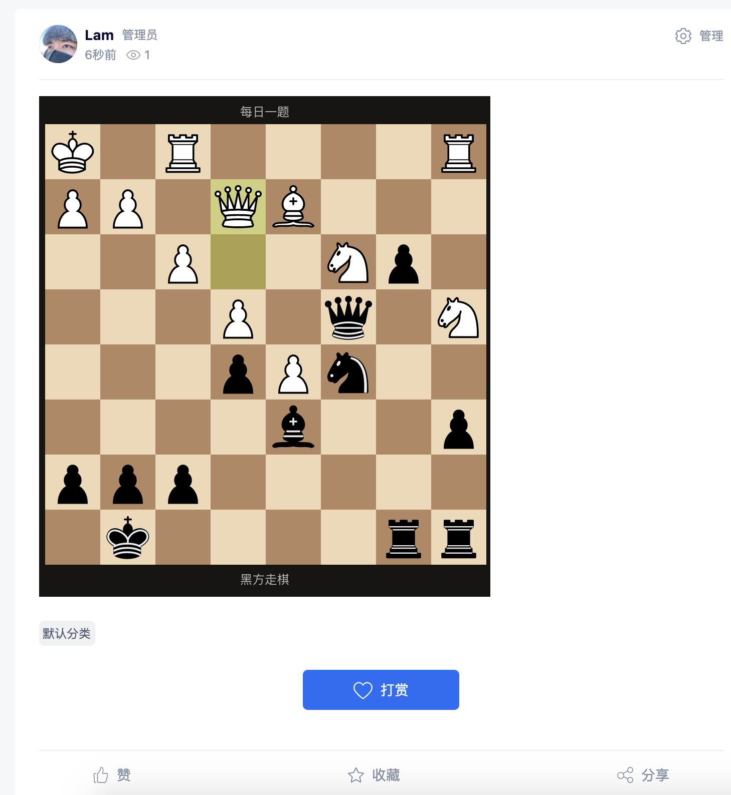
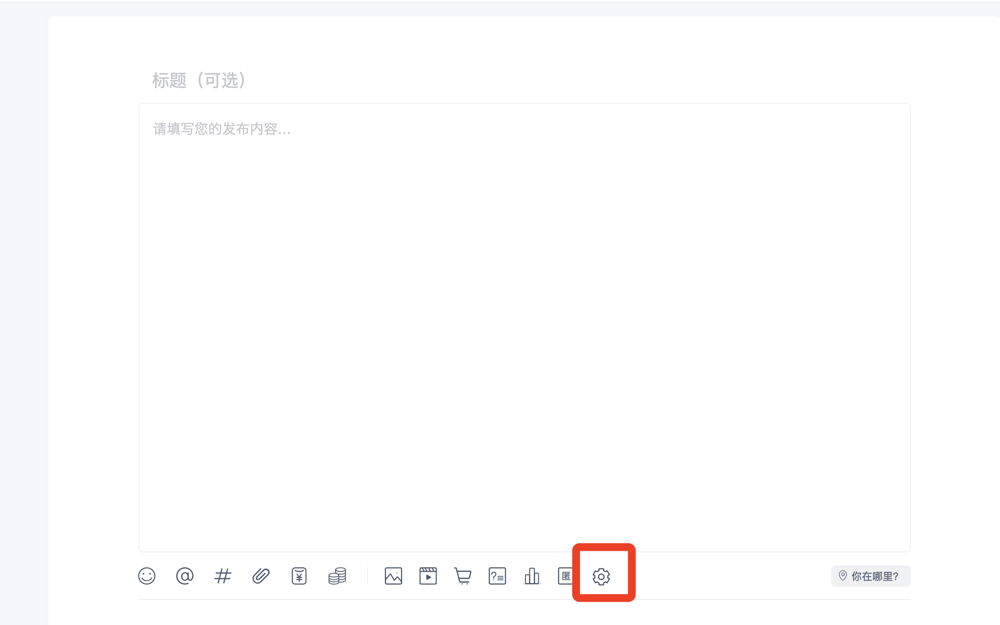
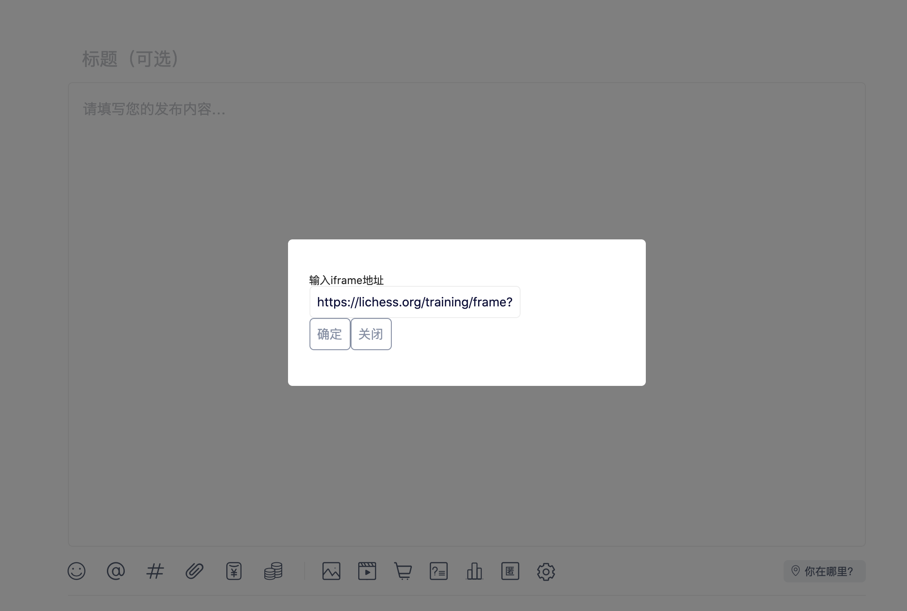
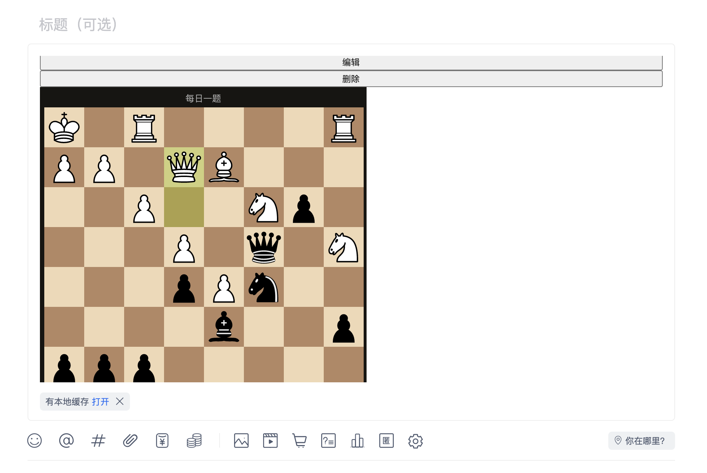

# 开始做一个插件

我们以编写一个简单的存前端插件作为入门示例，此示例属于一个自定义的`iframe`插件，在发帖时添加一个新的功能，让用户自行输入一个棋盘的链接，最终展示出来。



此功能包含3个插件组成：

- 发帖页扩展功能插件
- 发帖自定义iframe展示插件
- 发布后，帖子展示自定义iframe插件

首先我们在`common/plugin`目录下创建1个`CustomIfream`文件夹，根据规范，前端代码需要在`client`文件中。所以我们还需要在`CustomIfream`文件夹中新建`client`文件。

因为我们示例插件涉及到3个插件组成一个完整的功能，所以我们需要分别创建3个插件文件。

- CustomIfream
- CustomIfreamDisplay
- CustomIfreamPost

此刻我们的文件目录结果应该如下：

```sql
|- View
| |- src 
| | |- CustomIfream           
| | | |- ...            
| | |- CustomIfreamDisplay      
| | | |- ...     
| | |- CustomIfreamPost           
| | | |- ...
|- config.json
```

以下是每个插件的标准目录规范，后面将不再重复

```sql
|- View
| |- src 
| | |- CustomIfream           
| | | |- adapter            
| | | | |- web      
| | | | | |- index.jsx
| | | | |- mini      
| | | | | |- index.jsx
| | | | |- index.js
| | | |- main.js
| | |- ...   
|- config.json   
```

默认config.json内容如下：

```json
{
    "name_cn":"iframe插件",
    "name_en":"CustomIfram",
    "description":"...",
    "type":9,
    "app_id":"...",
    "version": "1.0.0",
    "status":1,
    "filter_enable":false,
    "author":{
        "name":"...",
        "email":"..."
    },
    "view": {
        "CustomIfram": {
            "target": "plugin_post",
            "hookName": "post_extension_entry_hook",
            "platform": ["pc", "h5", "mini"],
            "disables": false
        },
        "CustomIframDisplay": {
            "target": ["plugin_index", "plugin_detail"],
            "hookName": "thread_extension_display_hook",
            "platform": ["pc", "h5", "mini"],
            "disables": false
        },
        "CustomIframPost": {
            "target": "plugin_post",
            "hookName": "post_extension_content_hook",
            "platform": ["pc", "h5", "mini"],
            "disables": false
        }
    }
}
```

接下来我们一个一个组件进行实现。

## CustomIfream（发帖页扩展功能插件）

因为我们需要开发一个发帖插件，所以我们需要用到1个`taget`和1个`hook`。

- target: plugin_post
- hook: post_extension_entry_hook

> `plugin_post`描述是发帖页面使用，`post_extension_entry_hook`描述插件在功能扩展区使用。

首先编写我们的主程序文件。 main.js

```javascript
import Component from './adapter';
import config from '../../../config.json';

export default class CustomIframPost {
    static pluginName = config.name_en // 插件名称
    static version = config.version // 插件版本
    static author = config.author
    static platform = config.view.CustomIfram.platform;
    static target = config.view.CustomIfram.target // 插件使用目标
    static hookName = config.view.CustomIfram.hookName // 钩子名称
    static component = <Component/> // 需要渲染的组件
    static options = {} // 需要在注入时提供的额外数据
}
```

接着我们进入adapter目录，编写入口文件

adapter/index.js

```javascript
let pluginComponent = () => {};
if (process.env.DISCUZ_ENV === 'mini') {
    // taro项目的小程序
    pluginComponent = require('./mini/index.jsx');
}
if (process.env.DISCUZ_ENV === 'web') {
    pluginComponent = require('./web/index.jsx');
}

export default pluginComponent.default;
```

然后我们分别编写`小程序`和`浏览器`的具体组件实现。

adapter/web/index.jsx（浏览器）

```javascript
import React from 'react';
import { Icon, Dialog, Button, Input } from '@discuzq/design';

export default class CustomIfram extends React.PureComponent {
    constructor(props) {
      super(props);
      this.state = {
        visible: false
      }
    }
  
    render() {
      return (
          <>
            <Icon
                onClick={e => {
                    e.stopPropagation();
                    this.setState({
                        visible: true
                    })
                    // handleAttachClick(e, item);
                    // trggerInput(item);
                }}
                name='SettingOutlined'
                size="20" 
            />
            <Dialog
                visible={this.state.visible}
            >
                输入iframe地址
                <Input value='https://lichess.org/training/frame?theme=brown&bg=dark'/>
                <Button onClick={() => {
                    this.props.onConfirm({
                        postData: {
                            tomId: 900001,
                            body: {
                                url: 'https://lichess.org/training/frame?theme=brown&bg=dark'
                            }
                        }
                    });
                    this.setState({
                        visible: false
                    })
                }}>确定</Button>
                <Button onClick={() => {
                    this.setState({
                        visible: false
                    })
                }}>关闭</Button>
            </Dialog>
        </>
      )
    }
}
```

adapter/mini/index.jsx （小程序）

```javascript
import React from 'react';
import { Icon, Dialog, Button, Input } from '@discuzq/design';
import { View } from '@tarojs/components';

export default class CustomIfram extends React.PureComponent {
    constructor(props) {
      super(props);
    }
  
    render() {
      return (
          <>
            <Icon
                onClick={e => {
                    e.stopPropagation();
                    this.props.showPluginDialog(
                        <View>
                            输入iframe地址
                            <Input value='https://lichess.org/training/frame?theme=brown&bg=dark'/>
                            <Button onClick={() => {
                                this.props.onConfirm({
                                    postData: {
                                        tomId: 900001,
                                        body: {
                                            url: 'https://lichess.org/training/frame?theme=brown&bg=dark'
                                        }
                                    }
                                });
                                this.props.closePluginDialog();
                            }}>确定</Button>
                            <Button onClick={() => {
                                this.props.closePluginDialog();
                            }}>关闭</Button>
                        </View>
                    );
                }}
                name='SettingOutlined'
                size="20" 
            />
        </>
      )
    }
}
```

自此，我们已经完成了1/3的插件开发了。这是我们可以在web目录下运行`npm run dev`，启动来看看效果。



点击按钮的效果：



点击确定后，发现并没有任何效果展示，那是因为我们并没有为编辑器的钩子添加上对应的插件。

## CustomIfreamPost（发帖自定义iframe展示插件）

我们接着开发一个发帖时，编辑器内容区的插件，所以我们需要用到1个`taget`和1个`hook`。

- target: plugin_post
- hook: post_extension_content_hook

> `plugin_post`描述是发帖页面使用，`post_extension_content_hook`描述插件在编辑器的扩展内容区。

首先编写我们的主程序文件。 main.js

```javascript
import Component from './adapter';
import config from '../../../config.json';

export default class CustomIframPost {
    static pluginName = config.name_en // 插件名称
    static version = config.version // 插件版本
    static author = config.author
    static platform = config.view.CustomIframPost.platform;
    static target = config.view.CustomIframPost.target // 插件使用目标
    static hookName = config.view.CustomIframPost.hookName // 钩子名称
    static component = <Component/> // 需要渲染的组件
    static options = {} // 需要在注入时提供的额外数据
}
```

接着我们进入adapter目录，编写入口文件

adapter/index.js

```javascript
let pluginComponent = () => {};
if (process.env.DISCUZ_ENV === 'mini') {
    // taro项目的小程序
    pluginComponent = require('./mini/index.jsx');
}
if (process.env.DISCUZ_ENV === 'web') {
    pluginComponent = require('./web/index.jsx');
}

export default pluginComponent.default;
```

然后我们分别编写`小程序`和`浏览器`的具体组件实现。

adapter/web/index.jsx（浏览器）

```javascript
import React from 'react';
import { Icon, Dialog, Button, Input } from '@discuzq/design';

export default class CustomIframPostContent extends React.PureComponent {
    constructor(props) {
      super(props);
      this.state = {
      }
    }
  
    render() {
      const { _pluginInfo, renderData, deletePlugin, updatePlugin } = this.props;
      if ( !renderData ) {
        return null;
      }
      const { body, tomId } = renderData;
      const { url } = body;
      return (
          <div style={{display: 'flex', 'flexDirection': 'column'}}>
            <button onClick={() => {
              updatePlugin({
                postData: {
                  tomId,
                  body: {
                    url: 'https://baidu.com',
                  }
                }
              })
            }}>编辑</button>
            <button onClick={() => {deletePlugin()}}>删除</button>
            <iframe src={url} width='450' height='500'></iframe>
          </div>
      )
    }
}
```

adapter/mini/index.jsx （小程序）

```javascript
import React from 'react';
import { Icon, Dialog, Button, Input } from '@discuzq/design';
import { View, Text } from '@tarojs/components';

export default class CustomIframPostContent extends React.PureComponent {
    constructor(props) {
      super(props);
      this.state = {
      }
    }
  
    render() {
      const { _pluginInfo, renderData, deletePlugin, updatePlugin } = this.props;

      if ( !renderData ) {
        return null;
      }
      const { body, tomId } = renderData;
      const { url } = body;
      return (
          <View style={{display: 'flex', 'flexDirection': 'column'}}>
            <Button>编辑</Button>
            <Button onClick={() => {deletePlugin()}}>删除</Button>
            <Text>{url}</Text>
          </View>
      )
    }
}
```

自此，我们已经完成了1/3的插件开发了。这是我们可以在web目录下运行`npm run dev`，启动来看看效果。



这是时候我们发布帖子，正常情况下是能发布成功，但是我们回到首页，会发现对应刚刚发的帖子的内容没有展示出来，这个时候我们就要开发一个在帖子内容区的插件了。

## CustomIfreamPost（发布后，帖子展示自定义iframe插件）

我们接着开发一个发布后，帖子展示自定义iframe插件，所以我们需要用到2个`taget`和1个`hook`。

- target: 【plugin_index, plugin_detail]
- hook: thread_extension_display_hook

> `plugin_index`和`plugin_detail`描述是帖子列表和详情页面，`thread_extension_display_hook`描述插件在帖子扩展内容区展示。

首先编写我们的主程序文件。 main.js

```javascript
import Component from './adapter';
import config from '../../../config.json';

export default class CustomIframPost {
    static pluginName = config.name_en // 插件名称
    static version = config.version // 插件版本
    static author = config.author
    static platform = config.view.CustomIframDisplay.platform;
    static target = config.view.CustomIframDisplay.target // 插件使用目标
    static hookName = config.view.CustomIframDisplay.hookName // 钩子名称
    static component = <Component/> // 需要渲染的组件
    static options = {} // 需要在注入时提供的额外数据
}
```

接着我们进入adapter目录，编写入口文件

adapter/index.js

```javascript
let pluginComponent = () => {};
if (process.env.DISCUZ_ENV === 'mini') {
    // taro项目的小程序
    pluginComponent = require('./mini/index.jsx');
}
if (process.env.DISCUZ_ENV === 'web') {
    pluginComponent = require('./web/index.jsx');
}

export default pluginComponent.default;
```

然后我们分别编写`小程序`和`浏览器`的具体组件实现。

adapter/web/index.jsx（浏览器）

```javascript
import React from 'react';

export default class CustomIframDisplayContent extends React.PureComponent {
    constructor(props) {
      super(props);
      this.state = {
      }
    }
  
    render() {
      const { _pluginInfo, renderData, siteData } = this.props;
      if ( !renderData ) {
        return null;
      }
      const { body, tomId } = renderData;
      const { url } = body;
      return (
          <div style={{display: 'flex', 'flexDirection': 'column'}}>
            <iframe src={url} width={siteData.platform === 'pc' ? '450' : '100%'} height='500'></iframe>
          </div>
      )
    }
}
```

adapter/mini/index.jsx （小程序）

```javascript
import React from 'react';
import { View, Text } from '@tarojs/components';
export default class CustomIframDisplayContent extends React.PureComponent {
    constructor(props) {
      super(props);
      this.state = {
      }
    }
  
    render() {
      const { _pluginInfo, renderData, siteData } = this.props;
      if ( !renderData ) {
        return null;
      }
      console.log('mini', renderData);

      const { body, tomId } = renderData;
      const { url } = body;
      return (
          <View>
            <Text>{url}</Text>
          </View>
      )
    }
}
```

自此，我们已经完成了插件的开发。这是我们可以在web目录下运行`npm run dev`，启动来看看效果。


到这里一个简单的自动以ifream插件已经开发完成。

通过本地编译，将插件代码放入Discuz !Q前端仓库中的`common/plugin`，然后编译就可以看到你的插件生效了。