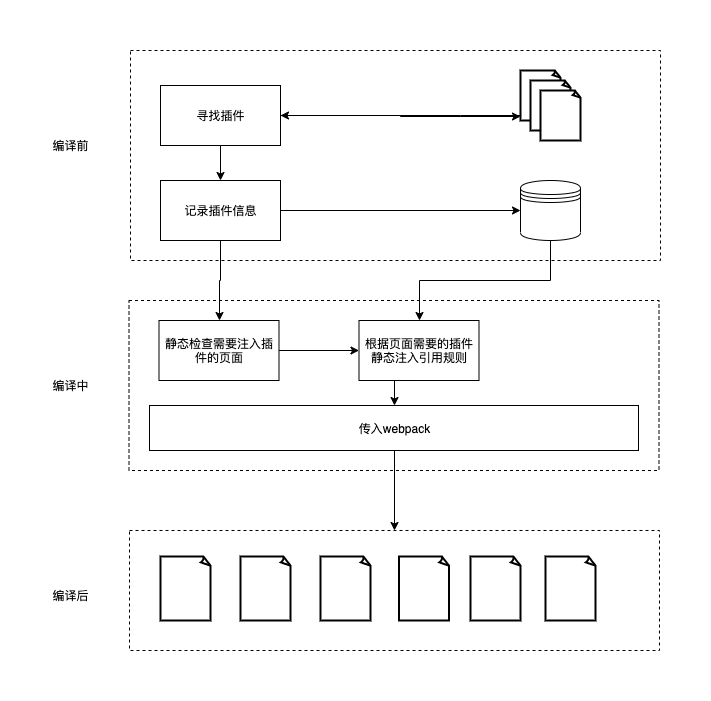

# 钩子开发

目前钩子开发需要改写源代码，如果只是插件开发者可以跳过，如果你想深度的二次开发，并且自己创建一些钩子出来，建议认真阅读。

在开始进行钩子开发之前，应该先了解一个插件从编译到注入页面运行时的流程，这样会对后续教学有更加深入的认知。

## 构建流程



一个完整的插件注入流程主要由以下3个包共通协助完成

- @discuzq/cli
- @discuzq/plugin-center
- @discuzq/discuz-plugin-loader

## 如何新增钩子

对于新增钩子有严格的要求，禁止顺便新增钩子，如果需要新增钩子，首先需要在`@discuzq/plugin-center`中，`injections`目录下新增对应钩子函数。在运行时，注入组件时必须要在`@discuzq/plugin-center`中找到对应钩子的注入器进行插件注入。

### 添加target

在`discuz-plugin-center/src/const.js`文件中添加新的`target`。

```javascript
export const PLUGIN_TARGET_LIST = [
    'plugin_system', 
    'plugin_index', 
    'plugin_detail', 
    'plugin_post', 
    'plugin_page'
];
```

### 添加注入器

在`discuz-plugin-center/src/injections/index.js`文件中添加新的注入器

```javascript
import plugin_detail2thread_extension_display_hook from './plugin_detail@thread_extension_display_hook';
import plugin_index2thread_extension_display_hook from './plugin_index@thread_extension_display_hook';
import plugin_post2post_extension_content_hook from './plugin_post@post_extension_content_hook';
import plugin_post2post_extension_entry_hook from './plugin_post@post_extension_entry_hook';
import plugin_system2add_page_hook from './plugin_system@add_page_hook';

const INJECTION_LIST = {
    'plugin_post@post_extension_entry_hook': plugin_post2post_extension_entry_hook,
    'plugin_post@post_extension_content_hook': plugin_post2post_extension_content_hook,
    'plugin_index@thread_extension_display_hook': plugin_index2thread_extension_display_hook,
    'plugin_detail@thread_extension_display_hook': plugin_detail2thread_extension_display_hook,
    'plugin_system@add_page_hook': plugin_system2add_page_hook
}

export default function getInjection (name) {
    if ( INJECTION_LIST[name] ) {
        return INJECTION_LIST[name];
    } else {
        return null;
    }
}
```

> 目前@discuzq/plugin-center未开源，开源后可自行修改.