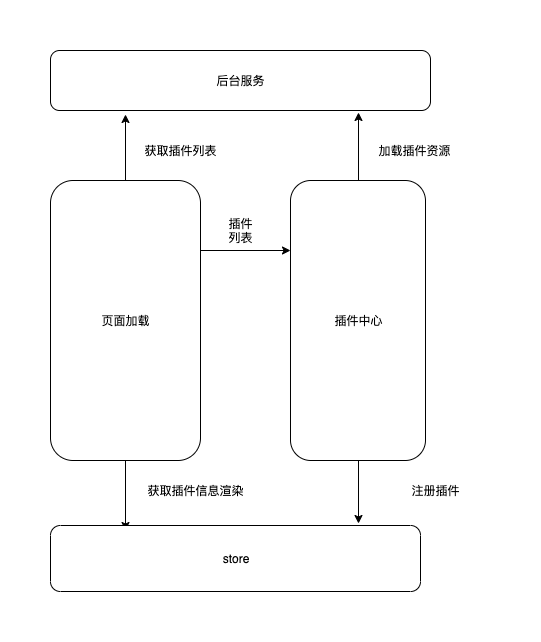

# 插件载入

插件分为3种载入方式:

- 内置插件
- 本地插件
- 远程插件

不同的载入方式分别应用于不同的场景。

## 内置插件

适合官方内置插件或深度二开，插件代码内嵌在前端主题代码内，`@discuzq/cli`会默认读取前端仓库中的`common/plugin`下所有符合标准的插件，注入到构建产物中。如报名帖，商品贴均采用此开发方式。

参考报名帖和商品贴，就是属于内置插件。内置插件在构建时，会读取`src`目录下的源代码进行编译，因为内置插件会进入主流程进行编译，便于代码复用和体积优化等。

> 如果你是开发者，可以使用内置插件进行开发，开发完毕后抽离出单独文件进行独立构建。

## 本地插件

本地插件只适用于小程序，因为小程序无法实现远程加载代码，对于小程序端的插件开发不太友好，我们可以通过以下两种方式对小程序进行引用第三方插件。

### 命令参数

当`@discuzq/cli`版本大于`1.3.12`时，可以通过参数`-plugin`参数为小程序指定一个外部文件夹，在编译时，`@discuzq/cli`会将外部的插件导入到小程序的构建中，实现小程序插件插拔能力。

改造`mini/`目录下的`package.json`中的`build`命令

```sql
# 旧
cross-env NODE_ENV=production dzq build -p mini --type weapp && npm run dist
# 新
cross-env NODE_ENV=production dzq build -p mini --type weapp --plugin <你的文件目录> && npm run dist
```

### 小助手工具

使用小助手的`1.0.4`版本及以上，通过配置项目信息会寻找对应目录中的插件，调用命令参数导入插件，并进行编译。

### 注意

本地插件目录是一个多插件的集合目录，其中的包含关系如下：

```sql
├── myPlugin ------------------ 插件目录
│   ├── pluginA ------ 插件A
│   |  ├── ...
│   |  ├── View
│   |  |  ├── src
│   |  |  ├── dist
│   |  |  ├── ....
│   |  └── config.json ----------- 插件基础配置文件
│   ├── pluginB ------ 插件B
```

## 远程插件

远程插件是DZQ插件体系的一大亮点，给插件提供热插拔机制，站长通过在管理后台上传标准插件，并且成功安装后，通过Discuz !Q在web端的运行时会请求插件接口，获取当前已经安装的插件，并获取到插件的文件地址进行异步加载，加载完毕后会自动注册插件并用于相对应的钩子中。



通过在Discuz !Q 3.0的管理后台上传相应的插件，那么在页面运行时，会请求`/api/v3/plugin/list`的接口，获取当前安装的插件信息，然后系统会自动去加载并且实例化插件到对应内容区中进行展示。

远程插件读取的是编译后的插件代码，读取的是`View/dist`下的文件。需要通过`@discuzq/cli`的`dzq plugin publish`命令进行构建后的产物。