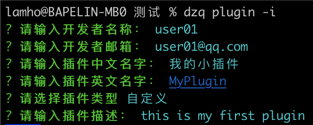
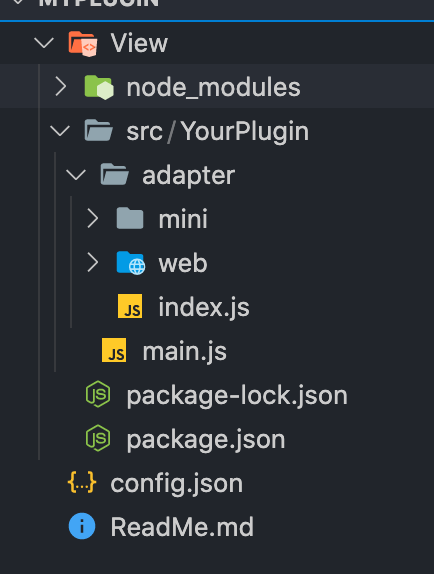

# 初始化一个插件

当我们需要准备要开发一个插件的时候，我们可以先使用 `@discuzq/cli` 的能力，初始化一个插件的基础模板，在此模板上进一步的开发属于你的插件。

## 全局安装cli

```sh
npm i @discuzq/cli -g
```

## 开始初始化
通过命令行工具，进入一个你指定的目录下，然后运行 `dzq plugin -i`。进入交互面板按照提示完成初始化的信息录入。



根据提示完成信息录入后，`cli`会自定完成插件项目的创建和依赖安装。完成后可以使用你喜欢的代码编辑打开项目，可以看到以下的目录结构：



 > 脚手架会默认帮你创建一个最基本的插件