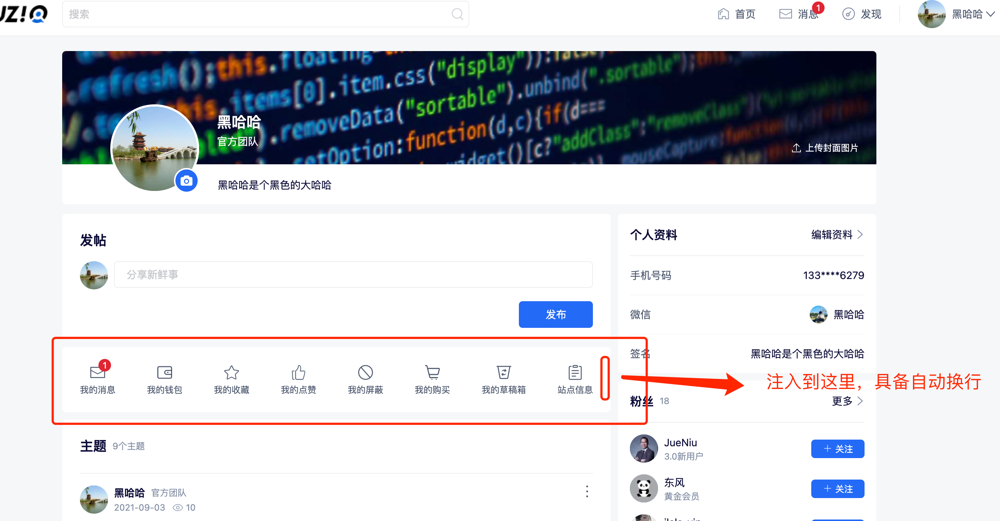
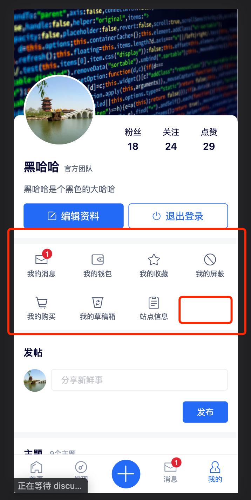

# 个人中心（plugin_user） hooks列表

## user_extension_action_hook

在个人中心选项卡区域增加扩展的选项卡

#### 平台支持

| 平台 | 是否支持 |
| :--- | :------: |
| PC   |    √     |
| H5   |    √     |
| Mini |    √     |

#### 参数

| 属性       | 值类型 | 描述                                 |
| :--------- | :----- | :----------------------------------- |
| renderData | object | 当前符合插件提交的数据，用于数据展示 |