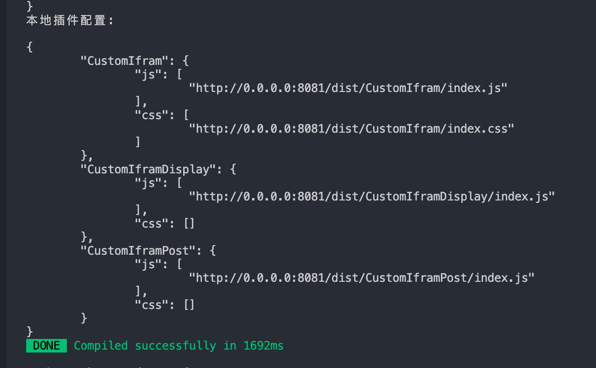
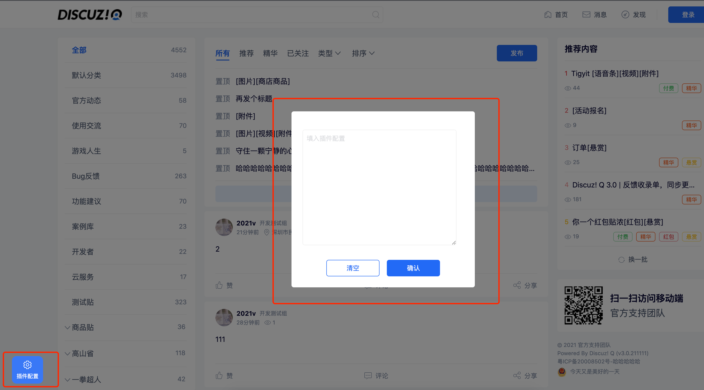

# 本地开发

因为小程序与web端的加载方式有比较大的区别，所以对于插件的开发有两种不同的方式进行调试。

## web端

web端的开发会基于异步加载的方式进行本地开发调试，通过同时运行2个服务，进行本地开发调试，同时可以模拟插件通过异步的形式加载，还原真实的运行时情况。

#### 插件编译

进入插件`View`目录下，运行`npm run server`命令。这时会监听插件代码变化，编译的代码会存放在内存当中。并且在插件运行server的时候，会在控制台输出一个`json`。



#### web端编译

进入你本地的小程序项目`discuz-fe`项目中的`web`目录，然后运行`npm run dev`。启动web端的本地开发。服务一般通过`http://0.0.0.0:9527`即可访问。

web端会有一个秘籍模式，通过在浏览器的`localStorage`中，添加一个`openPluginEnter`的key，值为`1`。然后刷新页面即可打开秘籍模式。

> v3.0.211104版本以上才有此功能。



通过复制小程序插件编译时输出的在控制台中的配置文件，复制进文本框中，点击确定，如果没有任何问题，那么就会开始加载本地的插件代码查看效果。


## 小程序

首先小程序插件无法像web端一样通过本地加载js的方式引入并生效，所以需要在编译前，需要将插件代码注入到项目代码中。

#### 插件编译

进入插件`View`目录下，运行`npm run watch`命令。这时会监听插件代码变化，同步编译出代码输出到`View`目录下的`dist`中。

#### 小程序编译

进入你本地的小程序项目`discuz-fe`项目中的`mini`目录，然后改写一下package.json中的命令，添加上指向你开发插件的目录。为小程序构建添加`--plugin`参数。

```sql
# 旧
cross-env NODE_ENV=development dzq dev -p mini --type weapp
# 新
cross-env NODE_ENV=development dzq dev -p mini --type weapp --plugin /Users/lamho/Desktop/plugin
```

> 注意：--plugin指向的不是插件自身目录，而是存放插件集合的文件路径。

```undefined
├── myPlugin
│   ├── pluginA
│   ├── pluginB
│   ├── ...
```

传入的应该是`myPlugin`这个文件所在的目录。

> `--plugin`指向的目录，在构建时导入插件的是插件的`src`目录中的源码进行构建。
>
> v3.0.211111版本以上才有此功能。